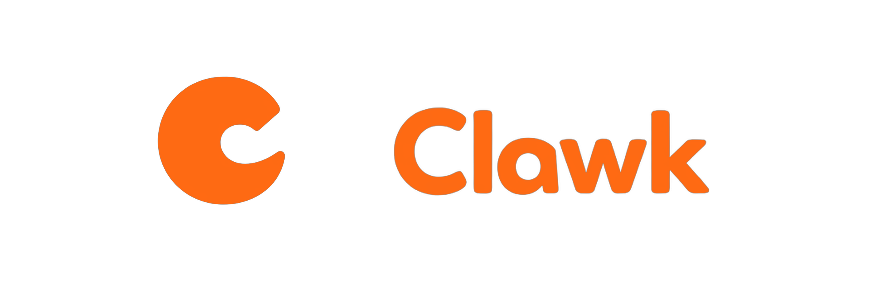
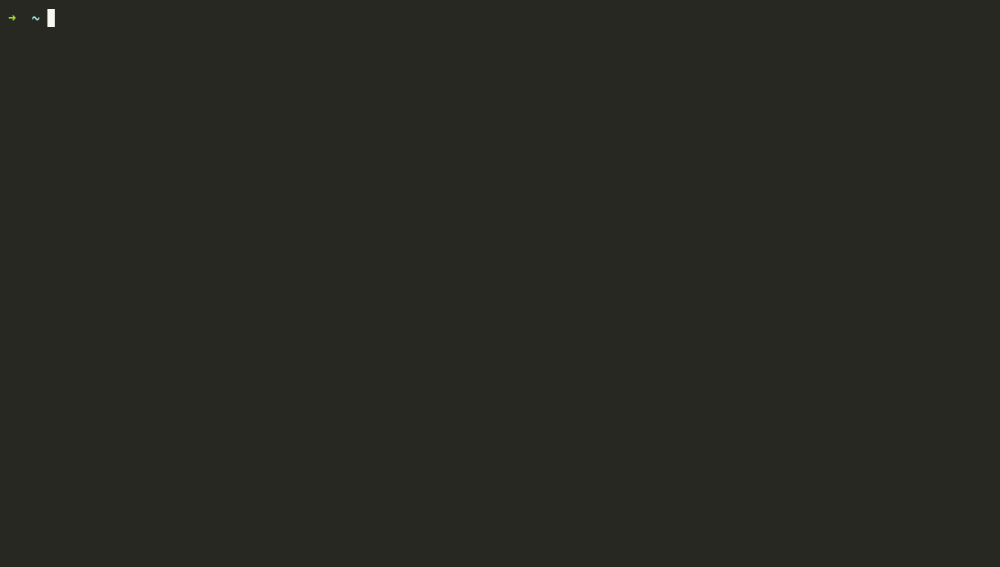

<div align="center">



*Give a coding agent its own disposable Linux machine, not yours.*

[](https://github.com/clawkwork/clawk/actions/workflows/ci.yml)
[](LICENSE)
[](go.mod)
-lightgrey)

**[Install](#install)** · **[Quickstart](#quickstart)** ·
**[Why a VM?](#why-a-vm)** · **[How it works](#how-it-works)** ·
**[Compared to](#compared-to)** · **[FAQ](#faq)** · **[Docs](docs/)**

</div>

A coding agent is only useful when you let it actually *do* things: install
packages, run the code it writes, start servers, use the network. On your own
machine that leaves two bad options. You approve every command (and babysit a
prompt every few seconds), or you run `--dangerously-skip-permissions` and hope
nothing important is one `rm -rf` or one leaked token away.

clawk is a third option. `cd` into a repo, type `clawk`, and Claude Code (or
Codex, or a shell) is working inside a disposable Linux VM (your code mounted
in, root in the guest, no permission prompts) while your files, your keychain,
and the rest of your machine stay out of reach. **The agent gets its own
machine instead of yours.**

<p align="center">
  
  <br>
  <sub><i>One command to a working agent; an attempt to send data to an
  unknown server, blocked by the network allow-list; <code>clawk attach</code>
  resumes the session later.</i></sub>
</p>

The boundary isn't a rule in a prompt the agent could be talked out of. It's
a separate machine, and the only openings are the ones you mounted. From a
shell inside a sandbox:

```console
$ curl https://tracker.evil.example   # not on the allow-list: blocked
curl: (7) Failed to connect to tracker.evil.example port 443 after 2 ms: Connection refused

$ cat ~/.ssh/id_rsa                   # your keys never entered the VM
cat: /home/agent/.ssh/id_rsa: No such file or directory

$ git push                            # ...yet this works: ssh-agent is forwarded
Enumerating objects: 5, done.
```

To be honest about the limits, the allow-list blocks connections to *unknown*
servers, not to ones you've allowed: github.com is pre-allowed and the
forwarded ssh-agent can push, so treat anything the agent can read as
something it could publish. The
[security model](#security-model-and-its-limits) spells this out.

And if the agent wrecks the VM, run `clawk destroy && clawk`: a fresh VM, same
repo, and `--resume` restores the conversation.

> [!IMPORTANT]
> **Pre-1.0 and moving fast.** Expect breaking changes between releases and
> the occasional rough edge; things can and will break. Please file issues;
> that feedback is shaping 1.0.

## Highlights

- **Let the agent do anything.** It runs in a disposable VM with a restricted
  network, so `rm -rf`, package installs, and untrusted code can't reach your
  host, your files, or anything you didn't explicitly share.
- **Working in one command.** `cd` into a repo and run `clawk`. No
  Dockerfile, devcontainer, or setup file. First boot builds a rootfs from
  your image; every boot after takes seconds.
- **Break it without losing anything.** Destroy and recreate freely; your
  code and the agent's conversations live on the host. Only the disposable
  VM disk is lost.
- **A real Linux box, your toolchain.** Any OCI image is the rootfs: a full
  OS with exactly the tools your project needs. No Docker daemon required.
- **Secrets stay on your machine.** Outbound traffic is allow-listed and your
  ssh-agent is forwarded, so `git push` works without keys entering the VM.
- **A sandbox per project or ticket.** Run several at once; multi-repo
  tickets get a git worktree per repo with coordinated PRs. Idle VMs
  automatically release memory and suspend to disk, so a forgotten sandbox
  costs (almost) nothing.

## Why a VM?

clawk is a general-purpose local environment for autonomous coding agents.
The VM is the point: it's a whole machine the agent can own, not a process
wrapped in policy on the one you're using.

- **A separate kernel.** The guest runs its own Linux kernel, so the host
  filesystem isn't hidden behind deny rules; it was never mounted.
- **A conventional Linux environment.** Standard kernel, standard userland,
  `/dev/kvm`-shaped expectations, so tools behave the way their docs say,
  without a syscall-filter surprise.
- **Root in the guest.** Install system packages, edit `/etc`, load a module,
  bind a privileged port. It's the agent's box to reconfigure.
- **A disposable lifecycle.** Cheap to break and quick to recreate; a wrecked
  VM is one `clawk destroy && clawk` away, with your repo and conversations
  untouched on the host.
- **Stronger separation from the host.** Isolation rests on the hypervisor
  boundary rather than on getting a process-sandbox policy exactly right.

That combination runs workloads a restricted process sandbox tends to fight
you on:

- installing packages and native dependencies;
- running background services (databases, queues, dev servers);
- executing untrusted builds and tests at full speed;
- using system-level Linux tooling that expects a real machine;
- and, with a KVM-enabled guest kernel on supported hardware, container and
  Kubernetes dev workflows such as Docker or Kind running *inside* the
  sandbox. This is opt-in and hardware-gated; see
  [Images](docs/images.md#guest-kernel-override) for the exact requirements.

None of this is the *product*; clawk is for local agent work in general.
Docker and Kubernetes are just the sharpest example of "needs a real machine,
not a sandboxed process."

## Install

Requires macOS 14+ on Apple silicon. (Linux is supported via firecracker and
currently experimental; see
[VM providers](docs/commands.md#vm-providers) for the gaps. This README is
macOS-first.)

```sh
brew install clawkwork/tap/clawk
```

**From source** (contributors, or if you don't use Homebrew), needs Go 1.26+:

```sh
git clone https://github.com/clawkwork/clawk && cd clawk
make install
```

Either way there's no extra host tooling: no Docker, no qemu, no sudo. The
hypervisor is Apple's Virtualization.framework, linked into the binary. First
run probes for anything missing and offers to fix it.

**Uninstall:** `clawk destroy` your sandboxes, `rm -rf ~/.clawk`, then remove
the binary with `brew uninstall clawk` (or delete it from `$GOBIN` for a
source install). Nothing else was installed: there are no launchd jobs; the
per-sandbox daemons are ordinary processes that exit with their VMs.

## Quickstart

The everyday case, a sandbox for the directory you're in:

```sh
cd ~/code/my-project
clawk                      # boot a sandbox for this dir + attach claude
clawk run shell            # drop into a shell in the same sandbox
clawk run codex            # or another agent: codex, opencode, shell
clawk down                 # stop the VM (repo + agent state persist)
clawk attach               # come back later — boots if stopped, reattaches claude
clawk destroy              # remove the VM (conversation history is kept)
```

Common options:

```sh
clawk run claude -- --resume            # pass args through to the agent
clawk forward add my-project 3000       # expose a guest dev server on localhost:3000
clawk network allow my-project api.example.com
```

Working on a ticket that spans several repositories? One command creates a
sandbox with a git worktree per repo on a fresh branch, and `clawk pr` later
opens cross-linked PRs for whatever changed:

```sh
cd ~/code/my-workspace     # contains a clawk.mod listing the repos
clawk work INFRA-123       # one sandbox, a worktree per repo, claude attached
clawk pr INFRA-123         # push branches + open one PR per repo
```

The full ticket lifecycle (status, follow-up branches after merges,
rebases) is in **[docs/ticket-mode.md](docs/ticket-mode.md)**.

> **Tip:** using Claude Code? Run `claude setup-token` then
> `clawk auth set-token` once, and every sandbox comes up already signed in,
> with no `/login` and no login conflicts between parallel sandboxes. See
> **[docs/claude-auth.md](docs/claude-auth.md)**.

## What survives what

One rule governs persistence: *the VM is disposable; everything you'd miss
lives on the host.*

| | `clawk down` | `clawk destroy` |
| --- | :---: | :---: |
| Your repo (mounted worktree; commits, branches) | ✅ | ✅ |
| Agent state (Claude/Codex conversations, memory) | ✅ | ✅ |
| The VM disk (apt installs, caches, `$HOME`) | ❌ (rebuilt fresh at every boot*) | ❌ (that's the point) |

\* Two exceptions: resuming a `clawk snapshot` restores the disk and
memory exactly as suspended, and the Linux/firecracker provider keeps
its disk until destroy. Tools every boot needs belong in the image
(`vm ( image … )`); per-boot setup belongs in `on up` hooks.

Agent state is host-mounted per sandbox: the guest's `~/.claude/projects/`
and `~/.claude/memory/` (and codex's `~/.codex/`) live under
`~/.clawk/namespaces/default/state/<name>/` on the host, so a recreated
sandbox picks up its old conversations with `--resume`.

## Full autonomy by default (and the `--safe` opt-out)

Runners launch in their "externally sandboxed" modes: claude gets
`--dangerously-skip-permissions`, codex gets
`--dangerously-bypass-approvals-and-sandbox`. On your own machine those flags
would be reckless; here they are the point: the VM boundary and the network
allow-list provide the containment, so the agent works at full speed without
per-action prompts. The agent can only affect what you mounted and
allow-listed, nothing more (see [SECURITY.md](SECURITY.md)).

Prefer the confirmation prompts anyway? Add `--safe` to any attach
(`clawk --safe`, `clawk run claude --safe`) and the runner starts without its
bypass flags for that session.

## Networking

Outbound traffic is denied by default; each sandbox has its own allow-list.
DNS resolves everything; TCP, UDP (including QUIC), and ICMP echo to unlisted
hosts are refused. Common registries (npm, PyPI, crates.io, GitHub,
Anthropic, …) are pre-allowed, and the filter is DNS-aware, so allowing
`example.com` keeps working as its IPs rotate.

```sh
clawk network allow my-project api.stripe.com '*.internal.mycorp.com' 10.0.0.5
clawk network denials my-project     # what the agent tried that got blocked
clawk forward add my-project 3000    # localhost:3000 → the guest's dev server
```

Denials are recorded by the *hostname the guest resolved*, so `clawk network
denials` reads as a log of what the agent tried to reach. Reusable named
policies (including subscribing to external blocklists like oisd) and the
`use` chain that layers them are in
**[docs/networking.md](docs/networking.md)**.

## Configuration: `clawk.mod`

No config file is required; defaults are sensible. When a project needs
more, a `clawk.mod` file describes it, in a go.mod-style syntax:

```text
sandbox my-project (
    vm (
        cpu    4
        memory 8GiB
        image  golang:1.25          # any OCI image is the rootfs
    )
    network ( allow api.example.com )
    forwards ( 3000 )
    env ( DATABASE_URL )            # names only; values come from your shell
    on create ( "go mod download" )
    agent (
        instructions "Ask before running destructive commands."
    )
)
```

The block is a *template*: snapshotted when the sandbox is created, so a
running sandbox never changes unexpectedly. The full reference (shares,
secret files, skills, agent memory seeding, multi-repo workspace roots) is
in **[docs/configuration.md](docs/configuration.md)**; images and custom
guest kernels (including the KVM-enabled kernel used for nested
virtualization) are in **[docs/images.md](docs/images.md)**.

## Lifecycle

```sh
clawk list                  # all sandboxes
clawk status [<name>]       # state, forwards, blocked hosts; --json for scripts
clawk up / down             # boot / stop
clawk pause / resume        # suspend / resume the running VM in memory
clawk snapshot              # save to disk: RAM freed, guest intact; resume restores it
clawk destroy               # remove the VM; host-side state persists
```

`clawk snapshot` is hibernation for sandboxes: the guest's memory is saved
beside its disk and the next boot restores the guest exactly where it was.
Background processes and dev servers continue as if nothing happened, and
`clawk attach` puts you back in front of the agent. The full command surface,
runner dispatch, and the idle-management machinery (ballooning, admission
control, auto-stop) are in **[docs/commands.md](docs/commands.md)**.

## How it works

```text
you ──▶ clawk CLI ──▶ per-sandbox daemon (detached; owns the VM)
                        ├─ gvproxy: in-process userspace TCP/IP stack —
                        │  the DNS-aware outbound filter the guest can't reconfigure
                        ├─ vsock bridge to the in-guest pty-agent (no sshd)
                        ├─ ssh-agent proxy, macOS (signing stays on the host)
                        └─ VM: Virtualization.framework (macOS) / firecracker (Linux)
                             ├─ clawk-init, PID 1 (no systemd, no cloud-init)
                             ├─ your repo, live-mounted over virtio-fs
                             └─ claude / codex / shell on a PTY
```

A few deliberate choices, in brief:

- **The rootfs is an ordinary OCI image.** clawk pulls it (no Docker daemon),
  flattens the layers, and writes an ext4 disk directly, with no root and no
  loop devices. Every sandbox from the same image is a copy-on-write clone
  (APFS `clonefile` / `FICLONE`), so per-sandbox disk cost is what the guest
  writes.
- **The network is filtered below the guest.** The VM's entire L3 (gateway,
  DHCP, DNS, NAT) is a userspace stack inside the daemon process. Every
  outbound connection and DNS answer consults the allow-list there, where
  even root inside the guest cannot change it. No host iptables, no sudo.
- **One way in.** No sshd, no cloud-init: a single vsock agent is the only
  control path into the guest, and each attach is container-exec-style: a
  fresh process, torn down on disconnect.

The full picture (the guest stack, both providers, the frame-level
networking) is in **[ARCHITECTURE.md](ARCHITECTURE.md)**, and the reasoning
behind each decision in **[DESIGN.md](DESIGN.md)**.

## Compared to

- **Containers & devcontainers.** They share your kernel and see your
  filesystem minus deny rules; a single kernel bug or a mistaken mount can
  expose the host. Devcontainer setups often bind-mount the host Docker
  socket to build images, handing the container control of the host daemon;
  clawk keeps Docker *inside* the VM instead. And there's no
  `Dockerfile`/`devcontainer.json` to write: any OCI image is the rootfs.
- **OS-level agent sandboxes.** Tools like Anthropic's sandbox-runtime apply
  process-level guardrails on your real machine: great for lightweight
  rules, but one policy mistake exposes everything (keychain included), and
  installs, background services, or a nested hypervisor are awkward to allow
  safely. clawk moves the whole workload onto a different machine.
- **General-purpose VM managers (e.g. Lima).** Lima gives you a Linux VM;
  clawk is a *workflow* on top of one: a VM per project with the repo
  mounted, an agent attached and authenticated, egress allow-listed by
  default and denials logged, agent conversations persisted across destroys,
  and a ticket mode that manages worktrees and PRs. (Under the hood both use
  Virtualization.framework.)
- **Cloud sandboxes.** Local-first: your code never leaves the machine,
  nothing is billed by the hour, and the worktree the agent edits is the one
  in your editor, live-mounted on macOS (the Linux provider currently bakes
  it in at create; see [Roadmap](#roadmap)). Cloud sandboxes fit fleets;
  clawk is for the machine on your desk.

## Security model (and its limits)

Two boundaries do the work: the VM (the host filesystem is invisible except
what you mount) and the outbound allow-list (enforced in userspace below the
guest, for every protocol that can leave it). What clawk does **not** protect
against:

- **Whatever you mount or allow is exposed.** Worktrees are writable, so an
  agent can commit bad code or push to any repo your forwarded ssh-agent can
  reach. Review what comes out of a sandbox like you'd review a stranger's
  PR.
- **Secrets you push in are visible.** `files ( … )` and `shares ( … )`
  contents, forwarded env vars, and the Claude token are the agent's to read
  (and, if a destination is allow-listed, to send there). Share the minimum.
- **Hypervisor escapes.** clawk relies on Virtualization.framework/KVM
  isolation; it does not add defenses beyond them.

If you find a way to break a boundary (guest-to-host escape, network-filter
bypass, credential leakage), please report it privately via
[SECURITY.md](SECURITY.md).

## FAQ

**What's the overhead?**
The first boot from an image pays a one-time rootfs build (pull → flatten →
ext4). After that, disks are copy-on-write clones and the kernel direct-boots,
with no firmware and no installer. Idle VMs release memory down to ~1 GiB, stop
automatically after 30 idle minutes, and can be snapshotted to disk so they
cost only storage.

**Does it work on Intel Macs? Windows?**
No. macOS needs Apple silicon (macOS 14+). On Linux, the firecracker
provider works but is experimental (see
[docs/commands.md](docs/commands.md#vm-providers)). No Windows support.

**Do I need Docker installed?**
No. clawk pulls OCI images and builds bootable disks itself. Docker *images*
are the input format; the Docker engine is not involved. (Running a Docker
daemon *inside* a sandbox is a separate, opt-in feature; see
[Images](docs/images.md#guest-kernel-override) for the hardware and kernel
requirements.)

**Why "clawk"?**
The mark is a claw; *clawkwork* is a play on *A Clockwork Orange*. A VM you
wind up, set loose, and can always reset.

## Roadmap

Next up: running more sandboxes than your RAM can hold at once.

- **Idle stops that snapshot.** Manual suspend-to-disk shipped as
  `clawk snapshot` / `clawk resume`; next, the *automatic* idle stop uses it
  too, so dev servers survive the stop and a suspended sandbox costs only
  disk.
- **A cap on running VMs.** Instead of refusing a new VM when RAM is
  committed, suspend the least-recently-used sandbox to disk and start the
  new one.
- **Firecracker parity.** Live worktree propagation and host-file push on
  Linux.

## Status

Pre-1.0 and under active development, and evolving quickly: expect breaking
changes between releases. The CLI surface changes least and internals most,
but nothing is frozen until 1.0.

## Contributing

Issues and PRs are welcome. See [CONTRIBUTING.md](CONTRIBUTING.md) to build
and test, [ARCHITECTURE.md](ARCHITECTURE.md) for how it's built, and
[DESIGN.md](DESIGN.md) for where it's headed.

## License

[Apache License 2.0](LICENSE). clawk vendors two third-party components under
their own licenses (gvisor-tap-vsock, Apache-2.0; an hcsshim ext4 writer, MIT);
see [NOTICE](NOTICE).
