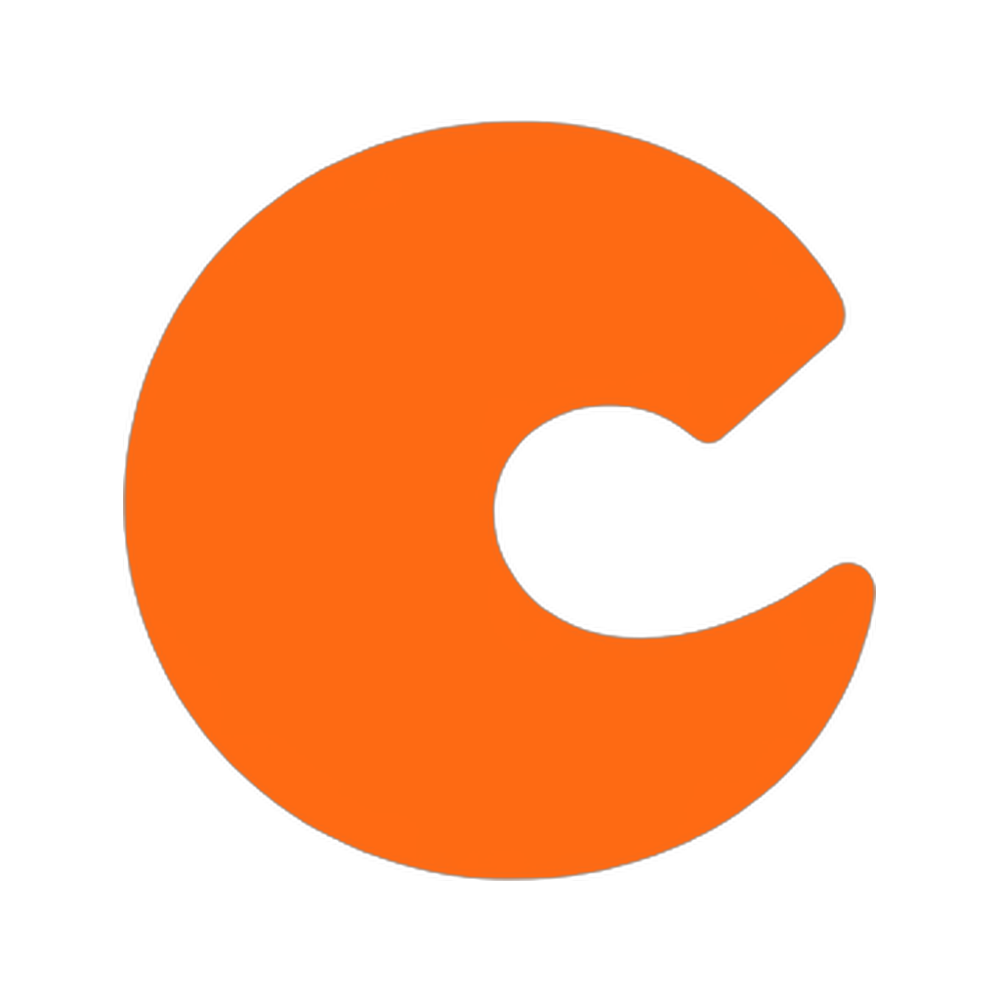

# Brand assets

clawk's logo and brand colour. The mark is an orange "C"-claw; the wordmark
plays on *clawkwork* → *A Clockwork Orange*.

| Asset | File | Use |
|-------|------|-----|
| Lockup (mark + wordmark) | [`clawk-lockup-orange-transparent.png`](clawk-lockup-orange-transparent.png) | README / docs / site header |
| Icon (mark only, square) | [`clawk-icon-orange-transparent.png`](clawk-icon-orange-transparent.png) | favicon, GitHub social preview, repo/org avatar |

<p>
  
  &nbsp;&nbsp;
  
</p>

## Colour

Brand orange — the same colour the CLI renders the spinner in
(`internal/cli/progress_ui.go`):

| | Hex | xterm-256 |
|--|-----|-----------|
| Primary | `#FF8700` | 208 |
| Gradient (light → dark) | `#FFAF00` → `#FF5F00` | 214 → 202 |

Colour is suppressed under the [`NO_COLOR`](https://no-color.org/) convention.

Both PNGs have transparent backgrounds; the orange reads on light and dark.
Keep the `-orange-transparent` suffix free for future variants (e.g. a white or
single-tone mark).

## README demo

`demo.gif` (rendered from `demo.cast`) is the README hero. The cast is
**synthesized**, not screen-recorded: `gen-demo-cast.js` replays clawk's real
output strings (create line, progress steps, detach hint, denials table,
attach boot notice) with staged timing; the Claude Code panel is a stylized
stand-in. To refresh it after CLI output changes — or to replace it with a
real recording before a release:

```sh
node assets/gen-demo-cast.js assets/demo.cast
agg --font-family "JetBrains Mono,DejaVu Sans Mono" --theme monokai \
    --font-size 16 assets/demo.cast assets/demo.gif
# or record the same storyline for real:
asciinema rec assets/demo.cast   # then agg as above
```
